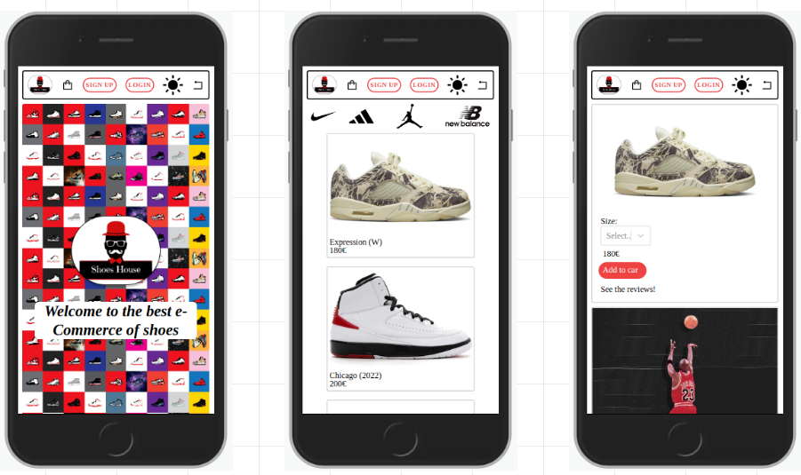

# Shoes-House

## Description

This application is called Shoes-House. It's a e-Commerce of shoes.



---
## Instructions

When cloning the project, change the <code>sample.env</code> file name for <code>.env</code>. The project will run on **PORT 8000**.
```
REACT_APP_API_URL=http://localhost:8000/api/v1

```

Then, run:
```bash
npm install
```

To start the project run:
```bash
npm run start
```

---
## User stories 

### MVP

- User can sign up and create a new account
- User can login
- User can log out
- User can see multiple shoes in order to buy


### Backlog

- User can view the reviews of a shoe
- User can post a review of a shoe
- User can add a shoe to the shopping cart
- User can delete a shoe of the shopping cart

---

## Useful links

- [Presentation slides](https://slides.com/elurgonzalezr/minimal)
- [Backend repository](https://github.com/elugon/ShoesHouse-Backend)
- [Backend deploy](https://shoes-house.herokuapp.com/)
- [Deployed app](https://shoes-house.netlify.app/)


